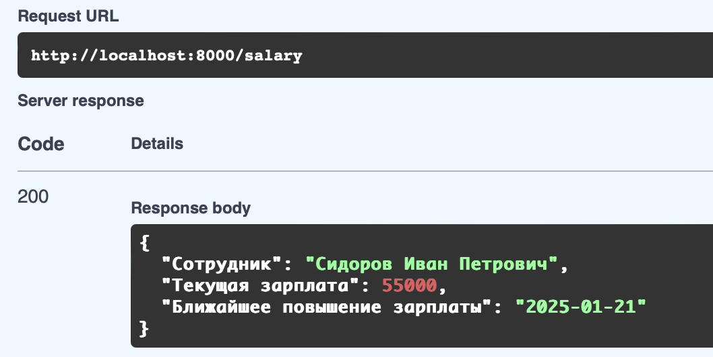

## Salary Watcher
REST-сервис, который по запросу сотрудника предоставляет информацию о его текущей зарплате и дате следующего повышения.

Сервис также позволяет зарегистрировать нового пользователя. Его имя, email, пароль (в хэшированном виде), размер текущей зарплаты и дата следующего повышения хранятся в базе данных Postgres. 

### Чтобы установить сервис:
- git clone https://gitlab.com/python_rest_projects/salary_watcher.git
- make run

### Чтобы воспользоваться сервисом:
- Откройте в браузере страницу http://localhost:8000/docs.
- Нажмите на плашку `Authorize` в правом верхнем углу. В раскрывшемся окне заполните поля логин (email) и пароль.
- В течение одного часа (срок действия полученного на предыдущем шаге jwt-токена) перейдите во вкладку `Get Salary` и нажмите на кнопку `execute`. Ответ будет получен в формате json.

### Пример ответа:

 

P.S.: База данных, создаваемая в докере, на старте пуста и не содержит данных о сотрудниках. Чтобы сотрудник в нее попал его нужно сначала зарегистрировать. Для этого вы можете воспользоваться соответствующей вкладкой на странице http://localhost:8000/docs.  